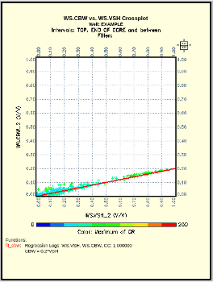
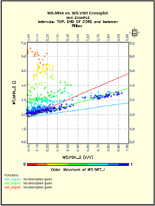

### Introduction:

###### This Python tutorial started from the PetroGG repository written by Mihai on GitHub

https://github.com/petroGG/Basic-Well-Log-Interpretation

###### His coding example was then modified with our own shaley-sand methods that are now being employed in Geolog as python loglan code. This particular example is from the Gulf of Mexico. The example has confentional and NMR logs. This is a shaly-sand well that utilizes Dual-Water and Waxman-Smits equations to account for the conductance of the clays in the calculations of the water saturations.  

###### Normally we would load the log data directly from a Geolog well from a loglan template specifically made for python as shown below: 

###### However, for this notebook the conventional logs and NMR data are being loaded from the Gulf_Coast_NMR.txt text file provided. 

###### The original PetroGG gave us a good foundation in building proper depth plots, cross plots and histograms in python. We have made a number of additions to the original PetroGG. First of all, we have modified the code to use a Vshale and not Vclay as was previously employed. Almost all shales have less than 100% clay volume. We have personally sampled some of the greasiest, gumbo shales to find that the maximum clay content was only about 65% according to the XRD or FTIR mineralogy data. Therefore, estimating the clay endpoint parameters for a clay point is a challenge since this 100% clay points is an imaginary points. This point does not exist in the data. Instead we use a shale point which can be observed in most shaly-sands data sets with a well develped shale. However, with sufficient mineralogy data from core samples or elemental log data like Schlumberger's Elemental Capture Spectroscopy (ECS), we could model the volume of clay for future applications. 

###### We have included two additional Saturation models suitable for shaly-sand analysis. We started with his Waxman-Smits and Dual-Water saturation models from his repository and then modified his code to employ George Coates' MRIAN Dual-Water and a Waxman-Smits iterative model where we calculate Qv from the Hill Shirley and Kein equation shown below.  

###### NMR data has been found to be quite useful in assessing reservoir quality and defining the volume of non-movable Capillary Bound Water (MBVI). However, the combination of NMR with conventional logs provides for a very holistic approach to our log analysis. One of the major benefits is accounting from the conductance due to Clay Bound Water (CBW) or the CBW saturation (Swb). CBW is associated with the waters chemically bound to the shales. CBW is determined from the difference between Total (PHIT) and Effective (PHIE) porosity. We typically start with the NMR effective porosity (MPHI for MRIL, or CMRP_3MS for SLB) as the effective porosity. In most oils and water with a high Hydrogen Index this is true. However, in light hydrocarbon, heavy oil and gas, the NMR effective porosity can be supressed. This results in an expanded CBW volume calculated from the difference between PHIT and the NMR effective porosity. This is called CBW apparent or CBWa.  

###### We typically use the plot of Vshale (or Swb) vs. CBWa as shown below to model CBW. As can be seen there is an excellent trend with these data. However, if there was gas or heavly oil, then there could be some samples that deviated from this trend showing much higher CBW volumes. We would ignore those data and concentrate on the primary trend shown below to model CBW for the entire well. 

                                   CBW = 0.2 * Vshale + 0

###### In this example we are using NMR data from an older Numar NMR tool that was only capable of measuring an NMR effective porosity (MPHI) and NMR Bulk Volume Irreducible (MBVI); all in the effective porosity system. This tool did not have the capability to employ the PR06 activation for the measurement of the Clay Bound Water (CBW) volume where the entire NMR signal then would be approaching total porosity. 

###### The NMR Capillary Bound Irreducible Water (MBVI) is calculated from the NMR T2 distribution by partitioning this T2 distribution into the Capillary Bound Water (MBVI) and Free Fluid (MFFI) based on a cutoff. The MFFI pore volume is associated with the larger pores with movable fluid where MBVI has the smaller pores with Capillary Bound Water that is a non-movable fluids. This partition point is called the T2 Cutoff, and for this clastic well the T2 Cutoff was 33ms. In Carbonate formations the T2 Cutoff is typically > 100ms due to the lower killing-strength in carbonate rock. 

## Saturation Models:

###### Since we have an estimated volume of CBW and Clay Bound Water Saturation (Swb = CBW/PHIT), we can use use the CBW volume to account for the conductivity of the CBW region and  calculate Qv for our shaley-sand saturation models. 

#### Dual-Water saturations using the George Coates (1) MRIAN analysis method developed at Numar to integrate conventional  and NMR log data for a robust interpretation. 

###### George Coates and the team at Numar devoped a Dual-Water saturation model that was near fool-proof and this was a part of their MRIAN analysis. They employed Dual-Water saturations and uses a variable 'w' for the electrical properties. They also accounted for an excess porosity calculated in the shales using RPHICLAY which discounted total porosity in the shales. 

####  Waxman-Smits saturation model using the Hill, Shirley and Klein equation(2) to calculate Qv from Swb as shown below:

                Qv = Swb/(0.6425/((Fluid_Density*Salinity(kppm))**0.5) + 0.22) 

###### We are using a standard iterative approach to Waxman-Smits or er have an option to use the equation provided by Crain in lieu of this iterative approach. 

###### Experience has shown that Waxman-Smits method is a bit more flexible to use in shaly-sand interpretations in that we can model the Waxman-Smits cementation exponent m* to vary with Vsh calibrated to Swb according to the trends observed in the wet intervals. A Cross Plot of Swb vs.  m*_apparent (MNA) is shown below.  The apparent m* increases as Vsh or Swb increase. This can best be ovserved in the wet intervals. m*_apparent goes quite high in the hydrocarbon bearing intervals and should not be used for the m* vs. Vsh or Swb trend. The m* at a Vsh or Swb of 0 (y-intercept) is the Archie m. , but in this case m* increases with increased Swb. We have also found that a wrong Rw can lead to an unrealistic y-intercept to give us feedback as to our choice of Rw too.

###### In the plot above for the y-axis values we calculated the apparent m* data using the following equation:

        m*_apparent = log10(Rw/(RT*(1+Rw*B*Qv)))/log10(PHIT)

###### The above plot shows m*_apparent vs. Vsh. Water saturations are on the z=axis. As can be seen, the wet trend (dark blue sample points) is rather well defined with a y intercept of approximately 1.9 and a slope of 1.8. The y intecpt at zero shale of Swb is the Archie m for the clean rock. This slope and intercept define the Waxman-Smits m*.  As Vsh or Swb incease, so does  m*. 

       m* = slope * Vsh + m_archie
       
###### From the above plot the the Archie m is 1.9 and the slope is 1.8. 

###### Finally, for our interpretation we typically compare our log analysis based Bulk Volume Water in the effective porosity system (BVWe) to MBVI, that is also in the effective porosity system, to determine what intervals have hydrocarbon saturations at irreducible water saturation with no movable water. In general, this is where we expect to have water free hydrocarbons if permeability is greater than 1mD. When BVWe is higher than MBVI, then we expect some movable water depending on the relative permeability and mobility of these fluids.

1. Coates, G.R., Gardner, J.S., and Miller, D.L., 1994, "Applying pulse-echo NMR to shaly sand formation evaluation", paper B, 35th Annual SPWLA Logging Symposium Transactions, 22 p.

2. Hill, H.J., Shirley, O.J., Klein, G.E.: “Bound Water in Shaley Sands - Its Relation to Qv and Other Formation Properties”, Log Analyst, May-June 1979.

3. Dacy, J., Martin, P.: "Practical Advances in Core-Based Water Saturation Analysis of Shaly Tight Gas Sands", SCA, SCA2009-29, 2009.
